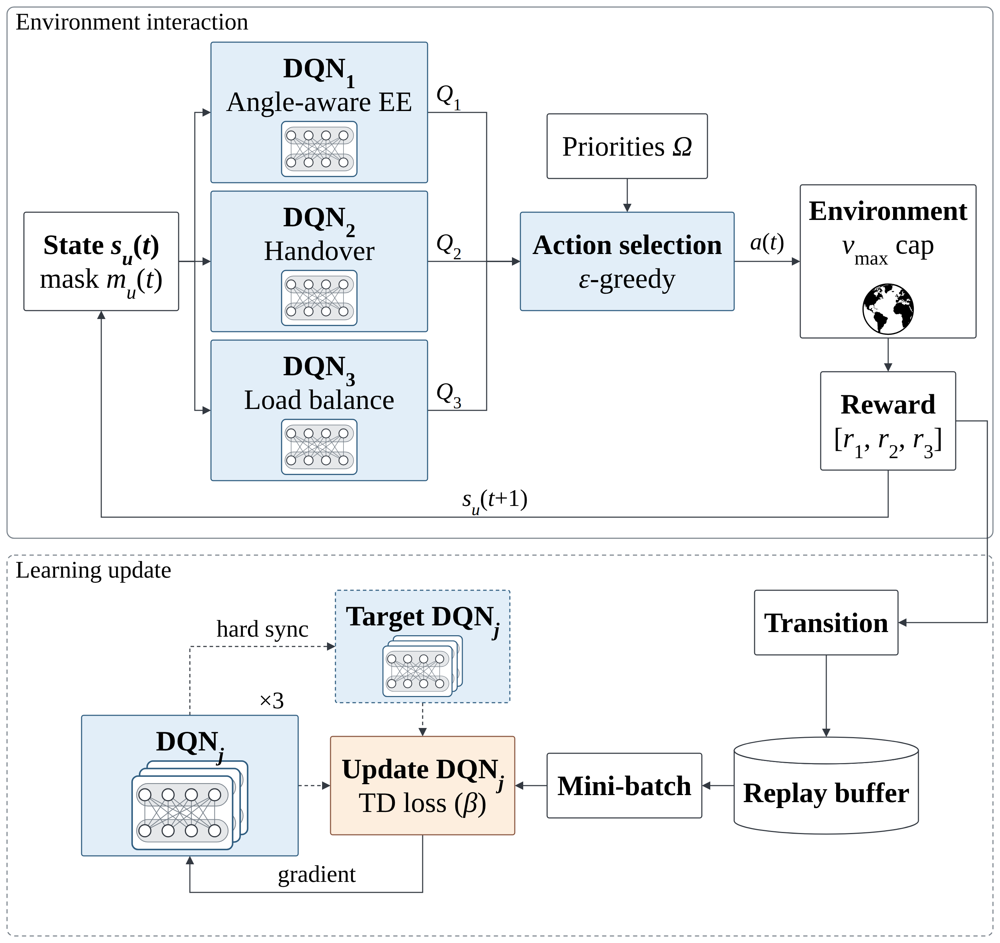
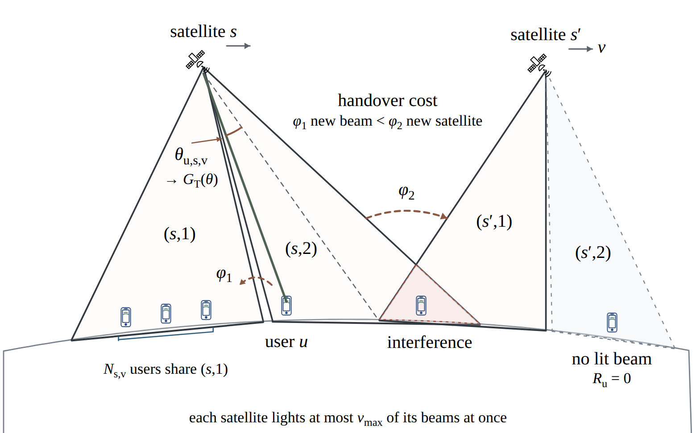

國立臺北大學資訊工程學系

Department of Computer Science & Information Engineering

National Taipei University

碩士論文

Master Thesis

指導教授：陳裕賢 博士

Advisor：Dr. Yuh-Shyan Chen

低軌多波束衛星網路之節能換手使用鯰魚多目標強化式學習

Energy-Efficient Handover in Multi-Beam LEO Satellite Networks:
A Multi-Catfish Reinforcement Learning Approach

研究生：吳柏宏

Student：Bo-Hung, Wu

中華民國 115 年 7 月

July, 2026

# 摘要

低軌衛星（LEO）網路覆蓋廣、延遲較低，但衛星高速移動使波束覆蓋快速變化，換手因而頻繁且不易決策。既有的多目標深度 Q 學習網路（Multi-Objective Deep Q-Learning Network, MODQN）以吞吐量、換手成本與負載平衡三個獎勵項建模此問題，但吞吐量獎勵未反映偏軸角與干擾對能量效率的影響。每位使用者又各自取最大值、看不到彼此的選擇，容易一起指向同一波束而過度集中；同一波束上的使用者均分頻寬，集中會直接壓低每個人的速率，而學習端從訓練到部署都看不到其他使用者當步的選擇。以該方法為基準，擴充為鯰魚多目標強化式學習（Multi-Catfish Reinforcement Learning, MCRL）框架。獎勵端把吞吐量改為角度感知能量效率，並由鏈路角度增益直接決定發射功率：每一段 uninterrupted served physical link 以固定的段起始功率 $p^{0}$ 起始，只有連續同一實體鏈路時才依前一步功率與角度增益比遞推。偏軸角降低波束增益時，同一連續服務段的遞推功率可能上升，並與實際 SINR、吞吐量及系統耗能共同改變能量效率；handover、outage、unserved、re-entry 與 episode reset 都重新起始。訓練時，主代理與鯰魚代理各是一組三目標 MODQN：兩端的三個 Q 網路均與能量效率、換手及負載平衡一一對應，鯰魚代理三網路則共用一條環境軌跡與一個經驗池。經驗塑形採能效分層、非對稱折扣與週期性混合批次介入，獎勵塑形只在鯰魚代理能效獎勵加入配對競爭項，兩者都只在訓練期作用，部署選法不變。

關鍵字：低軌衛星、多波束網路、換手決策、多目標強化式學習、MODQN、Multi-Catfish、負載平衡、能量效率

# 1. Introduction

近年來行動通訊朝第六代行動通訊與非地面網路發展。低軌衛星能提供大範圍覆蓋與較低傳播延遲，可服務偏遠地區、海上與空中等難以部署地面基礎建設的環境，因而受到重視。但低軌衛星高速繞行地球，使用者可連接的衛星與波束隨時間不斷改變，連線維持與換手決策也因此更加困難。

在多波束低軌衛星系統中，一顆衛星以多個波束服務不同地理區域，使用者可能因衛星移動、波束覆蓋邊界改變或服務品質下降，而需在不同波束或不同衛星間換手。若只依訊號強度選波束，可能造成部分波束負載過高；只追求減少換手，可能讓使用者停留在逐漸變差的連線；只顧負載平衡，又可能犧牲部分使用者的傳輸品質。因此，低軌衛星的多波束換手不宜只用單一指標，而需同時考慮吞吐量、換手成本與負載平衡等多個目標。

為了處理這類動態決策問題，既有研究已從深度強化式學習與多目標學習等方向處理低軌衛星換手問題，分別關注接取延遲與碰撞，以及吞吐量與換手成本等面向 \[1\], \[2\]。其中，Sun 等人提出的多目標深度 Q 學習網路（Multi-Objective Deep Q-Learning Network, MODQN）將低軌衛星多波束換手表達為多目標深度強化式學習問題 \[2\]。

另一方面，能源感知、波束增益與頻譜共存相關研究顯示，鏈路幾何、功率成本與干擾都會影響換手及能源評估 \[3\], \[4\], \[5\]；動態傳播條件下的換手研究強調通道狀態與負載 \[6\]，隨機流量和時變拓樸下的波束管理則凸顯服務品質、負載與系統資源之間的取捨 \[7\]。然而，前述研究多從個別面向處理問題，尚缺少一個將偏軸角、由角度增益直接決定的發射功率，以及 MODQN 多目標訓練整合於低軌衛星多波束換手的框架。

因此，本文以 MODQN 為基準，擴充為鯰魚多目標強化式學習（Multi-Catfish Reinforcement Learning, MCRL），並針對能量效率與波束集中問題調整獎勵與訓練方式。主要貢獻如下：

- MCRL 保留 MODQN 的多目標強化式學習架構，把第一個獎勵項由吞吐量改為角度感知能量效率。每個 uninterrupted served physical-link segment 以段起始功率 $p^{0}$ 起始，連續同一實體鏈路時由前一步功率與角度增益比遞推；同一個實際功率再決定干擾、吞吐量與系統耗能，公式不加 cap、clip 或 projection。
- MCRL 保留部署時逐使用者取最大值的選擇規則。訓練端加入經驗塑形與獎勵塑形，兩者只在訓練期間作用。部署時的輸入表示與選法都與 MODQN 相同。

其餘章節安排如下。第二章回顧低軌衛星換手、多波束資源管理、能量效率與強化式學習的相關研究。第三章說明系統模型與問題形式化。第四章介紹 MCRL 方法。第五章說明模擬設定與評估方式。第六章總結研究內容，並說明研究限制與未來可能方向。

# 2. Background

本章先回顧低軌衛星換手、多目標強化式學習、鯰魚競爭學習與容量受限決策，再說明本研究的問題定位。

## 2.1 Related Work

低軌衛星換手問題涉及衛星高速移動、波束覆蓋變化、使用者連線品質與系統負載等因素。既有研究首先將深度強化式學習用於換手決策。Lee 等人 \[1\] 以深度強化式學習學習換手協定，以降低接取延遲與碰撞情形。這類方法透過與環境互動學習決策，較能因應隨時間變化的通訊環境。

隨著能源成本受到重視，換手決策也開始納入能量考量。Ntabeni 等人 \[3\] 提出能量感知 Q 學習，把訊號品質、換手次數與能量效率一併納入。Chen 等人 \[4\] 提出聯合低軌衛星換手與快速波束切換（HOBS）演算法，利用歷史訊號品質與波束索引縮小搜尋範圍，以降低波束訓練延遲；該方法同時考量訊號干擾雜訊比、波束發射功率、波束增益與波束切換，並把同衛星與跨衛星干擾納入訊號品質計算。Mendonça 等人 \[5\] 在頻譜共存的換手情境中考量偏軸天線損失與干擾管理，說明波束角度與干擾對換手決策具有影響。Liu 等人 \[6\] 則以多代理深度強化式學習處理換手，以三態 Markov 模型描述動態傳播條件，使決策能同時考慮通道狀態、負載與換手表現。第三章的通道、干擾與功率模型參考了上述研究對訊號品質與波束功率的處理方式。

多目標強化式學習著重於換手決策中的多項取捨。Sun 等人 \[2\] 建立的 MODQN 把低軌衛星的多波束換手設計為多目標深度強化式學習問題，以吞吐量、換手成本與負載平衡為三個獎勵項，並用三個並行的 Q 網路各自學習一個目標的動作價值。由於同樣關注低軌衛星的多波束換手、且需同時處理多個目標，MODQN 是本方法最主要的基準。Song 等人 \[8\] 也以深度強化式學習將吞吐量、換手次數與負載平衡納入多目標換手。Tajmajer \[9\] 以決策值進行模組化純量化；Basaklar 等人 \[10\] 則讓不同目標在學習過程中分別處理，而非在一開始合成單一純量。MCRL 沿用 MODQN 的三個目標網路與線性純量化，改動集中在第一個獎勵的定義與訓練方式。

本研究採用的 MODQN 基準骨幹如圖 2-1。三個 Q 網路分別估計能量效率、換手與負載平衡的動作價值，再以權重 $\Omega$ 純量化並透過 $\epsilon$-greedy 選擇動作。環境回傳三維獎勵與下一狀態，轉移存入回放池後，以目標網路建立時間差分目標並更新三個線上網路。圖中第一個目標採用本研究的角度感知能量效率；MCRL 額外的訓練機制於第四章說明。

{width=155mm}

圖 2-1：本研究使用的 MODQN 基準骨幹。三個目標 Q 網路共用狀態與可行動作遮罩，經權重 $\Omega$ 純量化後選擇動作；環境轉移進入回放池，三個線上／目標網路分別以其目標獎勵更新。第一個目標顯示本研究採用的角度感知能量效率，與原始 MODQN 的吞吐量目標不同；圖中不含 MCRL 額外的訓練期塑形。

訓練經驗的選取與使用也會影響學到的策略。Schaul 等人 \[11\] 提出的優先經驗回放依時間差分誤差調整取樣機率，讓資訊量較高的轉移更常被使用。Ke \[12\] 提出的鯰魚效應深度強化式學習（CDRL）則在主代理旁加入鯰魚角色，於訓練中促進探索與經驗利用，而不直接輸出部署決策。CDRL 原本用於 RIS 輔助通訊的節能控制；本研究將此輔助訓練方式延伸到多目標換手，使主代理與鯰魚代理都採三目標 MODQN，每個代理內的三個網路分別對應三個目標。一般按網路實體建模的多代理強化式學習，會依問題設定把使用者、衛星或波束當作代理單位，讓多個代理共同決策。MCRL 的兩個代理則是同一換手問題中的訓練角色，不分別控制某個使用者、衛星或波束。鯰魚代理在訓練期間提供額外經驗與競爭訊號，主代理仍根據自己的經驗更新。第四章將說明這些訓練機制。

容量與資源限制也是多波束系統的重要問題。Zhu 等人 \[7\] 在隨機流量到達與時變拓樸的條件下探討多波束低軌衛星網路的波束管理，嘗試在服務品質、波束負載與系統資源之間取得平衡。在以強化式學習處理約束方面，Calvo-Fullana 等人 \[13\] 將約束資訊加入狀態，Agorio 等人 \[14\] 也將此作法用於多代理指派問題。Holder 等人 \[15\] 以強化式學習處理有限資源下的衛星指派，Ye 等人 \[16\] 則在蜂巢式網路中研究兼顧負載平衡的使用者關聯。第四章的訓練塑形策略以這些約束處理方法為參考。

## 2.2 Motivation

綜合第 2.1 節，本研究聚焦三個尚未被同時處理的問題。第一，既有多目標換手方法的第一個獎勵往往仍以吞吐量為主；能量感知研究則較少把鏈路角度增益、偏軸角造成的功率變化、干擾、實際吞吐量與系統能耗串成同一條能效計算鏈。第二，MODQN 的三個目標通常採用相同的學習流程，而既有鯰魚式輔助學習多設定在單一目標問題，尚未定義如何讓輔助訓練按不同目標分工。第三，每位使用者獨立選擇時，無法直接看見同一時間步其他使用者的選擇與各波束的壅塞程度；既有約束處理常改變部署時的指派程序，或將約束資訊加入狀態，較少在保留原本部署選法的前提下處理這個問題。

本研究以兩類設計回應上述問題。第一，將第一個獎勵改為角度感知系統能量效率的逐使用者可加貢獻，讓偏軸角造成的鏈路品質與功率代價進入同一個目標。第二，在 Multi-Catfish 訓練中，主代理與鯰魚代理都採三目標 MODQN，兩組各自的三個 Q 網路分別對應能量效率、換手與負載平衡。訓練過程包含經驗塑形與獎勵塑形：經驗塑形透過能效分層、非對稱折扣與週期性混合批次介入改變訓練時取用的經驗；獎勵塑形只在鯰魚代理的第一個目標加入同狀態的競爭比較，使輔助訓練有明確的目標對應。兩個塑形策略只在訓練期作用，部署時只保留主代理，每位使用者仍各自取最大值。

偏軸角增大時，波束增益降低，接收訊號與 SINR 可能下降，因而降低吞吐量；在同一連續服務段，前一步增益較高而目前增益降低時，previous-step recurrence 可能提高目前 RF power，並改變功率放大器耗能。新 segment 不沿用 inactive link 的功率，而是重新從 $p^{0}$ 開始；recurrence 不含 power cap、clip 或 projection。完整模型於第 3.1.3 節說明，正式獎勵於第 3.2 節定義。

# 3. Preliminaries

本章先說明使用者如何從可見波束中選擇服務波束，再介紹這條連線的訊號品質、吞吐量與耗能。最後將這些量整理成能量效率、換手成本與負載平衡三個目標。

## 3.1 System Model

### 3.1.1 Network Model

考慮一個多波束低軌衛星下行通訊系統。低軌衛星持續移動，因此使用者可見的衛星與波束會隨時間改變。將時間離散為依序排列、長度為 $\Delta t$ 的時間步，系統在每一步為每位使用者選擇一個可用的服務波束；$\Delta t$ 的設定列於第 5.1 節。整體場景如圖 3-1 所示。

{width=165mm}

圖 3-1：多波束低軌衛星網路的系統模型。每位使用者從可見衛星提供的候選波束中選擇服務波束。波束方向會影響訊號品質，多位使用者選到相同波束時會共同使用其資源；系統也必須考慮波束干擾與換手成本；沒有使用者選取的波束不會啟用。

#### Users, Satellites, and Beams

以 $\mathcal{U}=\{1,\ldots,U\}$、$\mathcal{S}=\{1,\ldots,S\}$ 與 $\mathcal{V}=\{1,\ldots,V\}$ 分別表示使用者、衛星與波束索引集合；$u$、$s$、$v$ 與 $t$ 則表示使用者、衛星、波束與時間步索引。

令 $x_{u,s,v}(t)$ 表示實際連線結果。當 $x_{u,s,v}(t)=1$ 時，使用者 $u$ 由衛星 $s$ 的波束 $v$ 服務；否則為 0。每位使用者最多連上一個波束，因此

$$
x_{u,s,v}(t) \in \{0,1\},\qquad
\sum_{s \in \mathcal{S}}\sum_{v \in \mathcal{V}}x_{u,s,v}(t) \leq 1.
\tag{3.1}
$$

以 $z_{s,v}(t)$ 表示波束 $(s,v)$ 是否啟用。對任意 $u\in \mathcal{U}$、$s\in \mathcal{S}$ 與 $v\in \mathcal{V}$，使用者只能連到已啟用的波束，因此

$$
z_{s,v}(t)\in\{0,1\},\qquad
x_{u,s,v}(t)\le z_{s,v}(t).
\tag{3.2}
$$

#### Beam Activation and Load

波束 $(s,v)$ 實際服務的使用者數量為

$$
U_{s,v}(t) = \sum_{u \in \mathcal{U}}x_{u,s,v}(t).
\tag{3.3}
$$

本研究只啟用有使用者連接的波束，波束的啟用狀態因此由連線結果直接決定：

$$
z_{s,v}(t)=
\begin{cases}
1,& U_{s,v}(t)>0,\\
0,& U_{s,v}(t)=0,
\end{cases}
\qquad \forall s \in \mathcal{S},\ v \in \mathcal{V}.
\tag{3.4}
$$

沒有使用者的波束不發射功率，也不產生干擾。本研究不另設每顆衛星可同時啟用的波束數上限。

### 3.1.2 Geometry and Channel Model

在低軌衛星通訊中，幾何關係同時決定使用者與衛星的距離，以及使用者相對於波束中心的方向。參考非地面網路通道模型與低軌衛星相關研究 \[17\], \[18\]，定義使用者 $u$ 與衛星 $s$ 之間的斜距如式 (3.5)：

$$
d_{u,s,v}(t) = \sqrt{R_{E}^{2}{\sin}^{2}\alpha_{u,s}(t) + h_{s}^{2} + 2R_{E}h_{s}} - R_{E}\sin\alpha_{u,s}(t).
\tag{3.5}
$$

其中 $\alpha_{u,s}(t)$ 為使用者相對於衛星的仰角，$R_{E}$ 為地球半徑，$h_{s}$ 為衛星高度。$v$ 將斜距記為候選波束鏈路層量；對同一顆衛星的不同波束，它的數值可以相同。斜距是後續線性鏈路功率因子的一部分，該因子不直接承載 wanted-link 的角度型樣。

偏軸角描述使用者方向與波束中心方向之間的角度差。多波束低軌衛星模型以兩個方向向量的夾角定義偏軸角 \[19, Eq. (5)\]，因此使用者 $u$ 相對於波束 $(s,v)$ 的偏軸角定義如式 (3.6)：

$$
\theta_{u,s,v}(t) = \arccos\left( \frac{\mathbf{v}_{u,s,v}(t) \cdot \mathbf{r}_{u,s,v}(t)}{\parallel \mathbf{v}_{u,s,v}(t) \parallel \parallel \mathbf{r}_{u,s,v}(t) \parallel} \right).
\tag{3.6}
$$

其中，$\mathbf{v}_{u,s,v}(t)$ 表示候選鏈路 $(u,s,v)$ 的波束中心方向向量，$\mathbf{r}_{u,s,v}(t)$ 表示同一候選鏈路由衛星指向使用者的方向向量。兩者以三下標標示資料所有權；同一波束的 $\mathbf{v}$ 可在不同使用者間取相同值，同一使用者與衛星的 $\mathbf{r}$ 也可在不同波束間取相同值。偏軸角是本文把幾何資訊導入能量效率的入口。

沿用多波束衛星常用、亦見於 HOBS 的角度型樣 \[4\], \[20\]，發射端增益只保留其對偏軸角的依賴：

$$
G^{T}\!\left(\theta,\theta_3\right),\qquad
G^{T}\!\left(0,\theta_3\right)=G_0.
\tag{3.7}
$$

其中 $G_0$ 為波束中心增益，$\theta_3$ 表示全 3 dB 半功率波束寬；因此其單邊半功率角為 $\theta_3/2$。為了讓正文的可調天線參數與模擬器一一對應，採用一層 normalized pattern 展開：

$$
G^{T}\!\left(\theta,\theta_3\right)=G_0F\!\left(\theta,\theta_3\right),
\qquad
G^{T}\!\left(0,\theta_3\right)=G_0,
\qquad
F\!\left(0,\theta_3\right)=1.
\tag{3.8}
$$

角度型樣採用 HOBS 式 (3) \[4\] 的 $J_1/J_3$ 型樣，角度參數與 pattern 為

$$
\mu\!\left(\theta,\theta_3\right)=2.07123\frac{\sin\theta}{\sin\left(\theta_3/2\right)},
\qquad
F\!\left(\theta,\theta_3\right)=
\left[
\frac{J_1\!\left(\mu\!\left(\theta,\theta_3\right)\right)}{2\mu\!\left(\theta,\theta_3\right)}
+\frac{36J_3\!\left(\mu\!\left(\theta,\theta_3\right)\right)}{\left[\mu\!\left(\theta,\theta_3\right)\right]^{3}}
\right]^2.
\tag{3.9}
$$

其中 $J_1(\cdot)$ 與 $J_3(\cdot)$ 分別為第一類貝索函數的一階與三階，$2.07123$ 是該式的固定角度參數，同一數值亦見於其他多波束衛星文獻；$F$ 在 $\theta=0$ 自然等於 1（$1/4+3/4$），因此不需要額外的 boresight 正規化常數；但 $J_1(\mu)/(2\mu)$ 與 $36J_3(\mu)/\mu^{3}$ 在 $\mu=0$ 是 $0/0$，數值上以 $|\mu|<\epsilon_\mu$ 時直接取該極限值處理，$\epsilon_\mu$ 的設定列於第 5.1 節。$\theta_3$ 雖是固定的天線參數，但它出現在 $\mu$ 定義式的右側，並經由 $\mu$ 決定 $F$ 與 $G^{T}$ 的形狀，因此列為三者的引數：每一條定義式的等號左側都必須涵蓋右側出現的量。$G_0$ 不同，它只是乘性的尺度常數，不改變型樣形狀，故不列入引數。式 (3.10) 之後的公式在特定鏈路的偏軸角上套用同一個函數，並明寫固定參數為 $G^{T}(\theta_{u,s,v},\theta_3)$。這一層不引入帶三下標的增益變數，也不設型樣選擇器。

本研究不沿用 HOBS \[4\] Table I 的 $G_0=40$ dBi。該表列出的孔徑 $10c/f_c$、增益 40 dBi 與波束寬三值互斥；在量綱合法的兩種讀法下，40 dBi 分別要求孔徑效率 $\eta=2.53$（半徑讀法）或 $\eta=10.13$（直徑讀法），**均大於 1**。本研究改由波束寬一致的孔徑重導：$D=1.0275\lambda/\theta_3=17.7\lambda$；取 3GPP TR 38.821 \[22\] 各列反推的 Ka 頻段孔徑效率 $0.639$–$0.645$，得 $G_0=2000$（$33.0$ dBi）。數值列於第 5.1 節。本研究的 $\theta_3$ 一律指**全**半功率波束寬，與第 5.1 節的格半徑 $R_b=h_s\tan(\theta_3/2)$ 一致；HOBS 式 (3) 以**單邊**半功率角為分母，故式 (3.9) 代入 $\theta_3/2$。常數 $2.07123$ 正校準於此點：$\mu=2.07123$ 時 $F=1/2$。

令 $H_{u,s,v}(t)$ 表示不直接承載 wanted-link 角度型樣的線性鏈路功率因子。為了與通道實作對應，H 展開為

$$
H_{u,s,v}(t)
=10^{-\frac{L_{u,s,v}(t)}{10}}
G^R_{u,s,v}(t),
\tag{3.10a}
$$

其中

$$
L_{u,s,v}(t)
=L_f\!\left(d_{u,s,v}(t),f_c\right)
+L_g\!\left(\alpha_{u,s}(t)\right)
+L_c\!\left(\alpha_{u,s}(t)\right)
+L_s\!\left(\alpha_{u,s}(t)\right).
\tag{3.10b}
$$

四項損耗沿用 HOBS 式 (1) 的四類損耗，本文以單字母下標記為 $L=L_f+L_g+L_c+L_s$：$L_f$ 為自由空間路徑損耗、$L_g$ 為大氣氣體吸收、$L_c$ 為閃爍、$L_s$ 為遮蔽衰落，後三項皆隨仰角變化，其模型與數值列於第 5.1 節；四項皆以 dB 表示，代入 H 前轉成線性尺度；$G^R_{u,s,v}(t)$ 是接收端線性增益。公開展開不再往下加項；掃描損耗、NLoS clutter 等實作層通道修正併入 $H_{u,s,v}(t)$，不取得公開符號，也不是可調參數。

$G^R_{u,s,v}(t)$ 以軸心增益扣除離軸損耗表示。令 $\theta^{R}_{u,s}(t)$ 為使用者接收天線指向與第 $s$ 顆衛星方向之間的夾角（以度為單位），則

$$
G^R_{u,s,v}(t)
=\min\!\left\{\max\!\left\{A_R-B_R\log_{10}\theta^{R}_{u,s}(t),\,G^{R}_{-}\right\},\,G^{R}_{+}\right\}.
\tag{3.10c}
$$

$A_R$、$B_R$ 與下限 $G^{R}_{-}$ 取自 ITU-R S.465-6 的地球站參考輻射型樣 \[21\]，其適用範圍為 2 至 31 GHz，涵蓋本文的 $f_c$。三者並非各自獨立設定：該建議書以 $A_R-B_R\log_{10}\theta^{R}$ 描述 $\theta^{R}_{-}\le\theta^{R}<48^{\circ}$，以 $G^{R}_{-}$ 描述 $48^{\circ}\le\theta^{R}\le180^{\circ}$，兩段在 $48^{\circ}$ 連續銜接。軸心增益 $G^{R}_{+}$ 取自低軌換手情境下同級 0.6 m 使用者終端所採的降額值 \[5\]，較該孔徑的理想增益保守約 4.7 dB。該建議書只在 $\theta^{R}\ge\theta^{R}_{-}$ 定義此包絡（本文終端在 $f_c$ 下 $\theta^{R}_{-}\approx2.498^{\circ}$）；本文於 $\theta^{R}<\theta^{R}_{-}$ 延用同一包絡至 $G^{R}_{+}$ 截止，此為建模上的簡化，不在該建議書的規定範圍內。

wanted-link 的兩個線性功率增益因子仍直接相乘為

$$
H_{u,s,v}(t)G^{T}\!\left(\theta_{u,s,v},\theta_3\right).
\tag{3.10}
$$

其中 $G^{T}$ 直接承載偏軸角，$H_{u,s,v}(t)$ 保留其餘通道因素的物理意義——包含式 (3.10b) 的四項損耗、接收增益，以及萊斯小尺度衰落（其 $K$ 因子 $K_R$ 屬情境校準，列於第 5.1 節）；兩者都是線性功率尺度的因子，不表示複數通道振幅。正文與簡化符號表、`/` legacy simulator 前端共用這個能和控制項／runtime 欄位對應的一層公開展開；三者只允許排版不同，不允許公式、符號或可調參數不同。公開展開的深度上限即 HOBS 正文所示的深度：式 (1) 的四項損耗，以及式 (3) 那一層的單一 $J_1/J_3$ 角度型樣結構。更深的天線量測、Bessel 近似誤差與通道校準細節不屬於公開主公式層級；不另建立只靠大小寫區分的中間通道符號。另需注意 MODQN 的 $G_{i,l,v}$ 是通道增益，其角色對應本文的 $H_{u,s,v}$，與此處的天線增益 $G^{T}$、$G^{R}$ 語意不同，不可同名合併。

### 3.1.3 Power, SINR and Throughput Model

以下只保留每一條 UE--衛星--波束鏈路的實際量。$p_{u,s,v}$ 表示實際 RF 發射功率，不再由目標 SINR、最低速率或 lagged interference 反推；若程式需要標記 measured、predicted 或 cached provenance，該資訊放在資料欄位 metadata，不另建立第二個物理 SINR。

令 $\tau_{u,s,v}$ 為目前 uninterrupted served physical link $(u,s,v)$ segment 的起始時間步。episode reset、handover、outage、unserved 與 re-entry 都會結束 continuity；新 segment 不保留 inactive-link cache，並以 $p^{0}$ 起始。只有同一實體鏈路在前後兩步都被服務時，角度感知功率才使用 previous-step recurrence：

這是本研究自行定義的角度感知功率規則，不是原始 MODQN 的公式。其建模條件是同一連續服務段內維持發射功率與發射增益的乘積：
$p_{u,s,v}(t,\theta_{u,s,v}(t),\theta_3)G^T(\theta_{u,s,v}(t),\theta_3)
=p_{u,s,v}(t-1,\theta_{u,s,v}(t-1),\theta_3)G^T(\theta_{u,s,v}(t-1),\theta_3)$。
把目前功率解出後，就得到下式；它只補償發射端角度增益，並不宣稱完整 SINR 或 throughput 固定。

$$
p_{u,s,v}\!\left(t,\theta_{u,s,v}(t),\theta_3\right)
=p_{u,s,v}\!\left(t-1,\theta_{u,s,v}(t-1),\theta_3\right)
\frac{G^{T}\!\left(\theta_{u,s,v}(t-1),\theta_3\right)}
     {G^{T}\!\left(\theta_{u,s,v}(t),\theta_3\right)},
\qquad x_{u,s,v}(t-1)=x_{u,s,v}(t)=1,
\quad G^{T}\!\left(\theta_{u,s,v}(t),\theta_3\right)>0,
\tag{3.11}
$$

segment 起始與 segment 內的 closed form 為

$$
p_{u,s,v}\!\left(\tau_{u,s,v},\theta_{u,s,v}(\tau_{u,s,v}),\theta_3\right)
=p^{0},
\qquad p_{u,s,v}\!\left(t,\theta_{u,s,v}(t),\theta_3\right)
=p^{0}\,
\frac{G^{T}\!\left(\theta_{u,s,v}(\tau_{u,s,v}),\theta_3\right)}
     {G^{T}\!\left(\theta_{u,s,v}(t),\theta_3\right)}.
\tag{3.12}
$$

式 (3.12) 只有在 $\tau_{u,s,v}$ 到 $t$ 的每一步都維持同一 served physical link 且角度增益為正時成立；它是式 (3.11) 的 telescoped identity，不是跨事件的 runtime state。這個關係表達前一步角度增益如何遞推實際鏈路 RF power，不引入目標 SINR、需求功率反推、beam／satellite cap、PA clamp 或 `min`／`max` 投影。

在系統層定義全體角度狀態 $\boldsymbol{\theta}(t)$——即每一個 $u\in \mathcal{U},\ s\in \mathcal{S},\ v\in \mathcal{V}$ 的偏軸角 $\theta_{u,s,v}(t)$ 所組成的集合——並令 $I_{u,s,v}(t,\theta_{u,s,v},\theta_3)$ 表示相對於 wanted link 的總同頻干擾。

波束以三色頻率重用配置。令 $c_{s,v}\in\{0,1,2\}$ 為波束 $(s,v)$ 的頻率顏色，依其地面蜂巢在六角格上的軸向座標 $(q_{s,v},r_{s,v})$ 指派為 $c_{s,v}=(q_{s,v}-r_{s,v})\bmod 3$。此規則使六角格上任兩個相鄰蜂巢必為異色：同色波束共用同一子頻帶，異色波束彼此正交。因此單一波束的可用頻寬為 $B^{w}=B^{g}/3$，而干擾只來自與服務波束同色且已啟用的其他波束。蜂巢排列與各波束的軸向座標屬環境設定，於第 5.1 節說明。

一支已啟用的波束以單一功率發射，不論其上載有幾位使用者；沿用執行端的聚合慣例，令 $p_{s,v}\!\left(t,\boldsymbol{\theta},\theta_3\right)=\max_{u\in\mathcal{U}:\,x_{u,s,v}(t)=1}p_{u,s,v}\!\left(t,\theta_{u,s,v}(t),\theta_3\right)$ 為該波束的發射功率。左側保留全系統角度狀態與固定波束寬參數，因為右側會在所有已服務鏈路中取最大值。參考 HOBS 與多波束低軌道衛星系統模型 \[4\], \[20\]，將干擾分為同衛星干擾與跨衛星干擾，分別如式 (3.12a) 與式 (3.12b)：

$$
I^{i}_{u,s,v}(t,\theta_{u,s,v},\theta_3)
=\sum_{\substack{v'\in\mathcal{V},\ v'\neq v\\ c_{s,v'}=c_{s,v}}}
z_{s,v'}(t)\,p_{s,v'}\!\left(t,\boldsymbol{\theta},\theta_3\right)\,G^{T}\!\left(\theta_{u,s,v'}(t),\theta_3\right)H_{u,s,v'}(t),
\tag{3.12a}
$$

$$
I^{x}_{u,s,v}(t,\theta_{u,s,v},\theta_3)
=\sum_{s'\in\mathcal{S},\ s'\neq s}\ \sum_{\substack{v'\in\mathcal{V}\\ c_{s',v'}=c_{s,v}}}
z_{s',v'}(t)\,p_{s',v'}\!\left(t,\boldsymbol{\theta},\theta_3\right)\,G^{T}\!\left(\theta_{u,s',v'}(t),\theta_3\right)H_{u,s',v'}(t),
\tag{3.12b}
$$

且 $I_{u,s,v}(t,\theta_{u,s,v},\theta_3)=I^{i}_{u,s,v}(t,\theta_{u,s,v},\theta_3)+I^{x}_{u,s,v}(t,\theta_{u,s,v},\theta_3)$。每一項都以該干擾波束自己的偏軸角與線性鏈路因子計算，因為不同波束到同一位使用者的路徑損耗與增益都不同；求和以啟用指示 $z$ 為門檻，而不是以其上載有幾位使用者為權重。

雜訊功率為 $\sigma^{2}=k_BTB^{w}$，其中 $k_B$ 為波茲曼常數，$T=T_a+T_0\left(10^{N_f/10}-1\right)$ 為接收系統溫度。$T_a$ 為天線溫度、$N_f$ 為接收機雜訊指數、$T_0$ 為雜訊指數的參考溫度，數值取自 3GPP TR 38.821 的 VSAT 設定 \[22\]，列於第 5.1 節。雜訊在整支波束的頻寬上積分，因此與該波束的載量無關。唯一的鏈路 SINR 為

$$
\gamma_{u,s,v}\!\left(t,\theta_{u,s,v},\theta_3\right)
=
\frac{
p_{u,s,v}\!\left(t,\theta_{u,s,v},\theta_3\right)
H_{u,s,v}(t)
G^{T}\!\left(\theta_{u,s,v},\theta_3\right)
}{
I_{u,s,v}\!\left(t,\theta_{u,s,v},\theta_3\right)+\sigma^{2}
},
\tag{3.13}
$$

其中 $I_{u,s,v}(t,\theta_{u,s,v},\theta_3)+\sigma^2>0$。這個符號同時用於基線鏈路計算與角度感知功率替換；不另定義 estimated、required、target 或帶 serving-index 巢狀下標的 SINR。

波束內採時分多工，同一波束上的 $U_{s,v}(t)$ 位使用者依序使用可用頻寬。因此鏈路 throughput 為 \[2\], \[4\]

$$
R_{u,s,v}\!\left(t,\theta_{u,s,v},\theta_3\right)
=\frac{B^{w}}{U_{s,v}(t)}
\log_2\!\left(1+\gamma_{u,s,v}\!\left(t,\theta_{u,s,v},\theta_3\right)\right),
\qquad U_{s,v}(t)>0.
\tag{3.14}
$$

$B^w$ 是單一波束可用頻寬；單一使用者展示時只令 $U_{s,v}=1$，不另建立第二套 rate 或 SINR 公式。連線變數 $x_{u,s,v}(t)$ 只負責選取實際服務鏈路，不另建立 user-level 的 SINR 或 throughput 別名。

一支波束由單一功率放大器驅動，因此電源端功率是逐波束而非逐鏈路的量。令 $\xi_{s,v}\!\left(t,\boldsymbol{\theta},\theta_3\right)>0$ 為該波束由 RF power 到電源端消耗的有效轉換效率，則

$$
P^{p}_{s,v}\!\left(t,\boldsymbol{\theta},\theta_3\right)
=\frac{p_{s,v}\!\left(t,\boldsymbol{\theta},\theta_3\right)}
{\xi_{s,v}\!\left(t,\boldsymbol{\theta},\theta_3\right)}.
\tag{3.15}
$$

發射出去的功率不等於實際耗掉的功率。波束的射頻訊號由功率放大器產生，其射頻輸出與所取用直流功率之比即為式 (3.15) 的 $\xi$。放大器接近飽和點時效率較高但較不線性，因此實務上退離飽和點一段距離運作，該距離稱為輸出回退 $b_o$（以 dB 表示）：飽和功率為 $p^{s}=p^{+}10^{b_o/10}$，其中 $p^{+}$ 是回退後的每波束操作上限。參考傳統類 B 功率放大器的功率與效率關係 \[23\]，以負載相依的平方根曲線近似回退區的效率變化；這是便於系統層分析的工程近似，不是完整的電路模型：

$$
\xi_{s,v}\!\left(t,\boldsymbol{\theta},\theta_3\right)
=\min\!\left\{\xi^{+},\ \xi^{+}\sqrt{\dfrac{p_{s,v}\!\left(t,\boldsymbol{\theta},\theta_3\right)}{p^{s}}}\right\}.
\tag{3.15a}
$$

平方根可由類 B 的理想近似理解：令 $V_o$ 為輸出電壓振幅，在固定供應電壓與負載下射頻輸出功率滿足 $p_{s,v}\propto V_o^{2}$，平均直流輸入功率則近似滿足 $P^{p}_{s,v}\propto V_o$，因此 $\xi=p_{s,v}/P^{p}_{s,v}\propto\sqrt{p_{s,v}}$。射頻輸出為飽和功率的四分之一時，效率是 $\xi^{+}/2$ 而不是 $\xi^{+}/4$。$\xi^{+}$ 與 $b_o$ 的數值列於第 5.1 節；Ka 頻段衛星下行 GaN Doherty MMIC 的實測飽和功率附加效率為 23--31%，6 dB 輸出回退時約 20% \[24\]，與本模型的量級一致，但並非同一測量點。Morello 與 Mignone 的雙載波 DVB-DSNG 範例對每一載波採 5.5 dB 輸出回退 \[25\]，說明多載波操作為維持準線性區需要較大的回退；該敘述不足以泛化到所有多載波系統，此處僅作為回退量級的旁證。

這個形狀有一個對本論文重要的後果：由於低輸出時效率較差，把發射功率壓低並不會等比例降低功率消耗。真正影響能量效率的是「用多少功率換到多少吞吐量」，這也是第 3.2 節把能量效率而非單純發射功率作為第一個目標的理由。

令 $P^{f}(t)$ 彙總所有不直接由偏軸角控制的 fixed／circuit overhead。令 $N^{a}_{s}(t)=\sum_{v\in\mathcal{V}}z_{s,v}(t)$ 為衛星 $s$ 的啟用波束數；本研究將一支啟用波束對應到一條射頻鏈，則

$$
P^{f}(t)=\sum_{s\in\mathcal{S}}\left(
N^{a}_{s}(t)\,P^{c}
+\mathbb{1}\!\left\{N^{a}_{s}(t)>0\right\}P^{b}
\right).
\tag{3.16a}
$$

基頻功率由該衛星的所有啟用波束共用，因此每顆衛星只計一次，不會重複計入。$P^{c}$ 與 $P^{b}$ 的數值取自 You 等人 Table II \[26\]，列於第 5.1 節。「一支波束對應一條射頻鏈」是本研究的對應設定，不是該文的衛星架構結論；該文另含本振功率與相移器功率，本研究不納入，因此式 (3.16a) 是 partial payload-power model，不是完整的衛星總功率模型。系統總功率為

$$
P^{N}\!\left(t,\boldsymbol{\theta},\theta_3\right)
=P^{f}(t)+
\sum_{s^{\prime}\in \mathcal{S}}\sum_{v^{\prime}\in \mathcal{V}}
z_{s^{\prime},v^{\prime}}(t)\,
P^{p}_{s^{\prime},v^{\prime}}\!\left(t,\boldsymbol{\theta},\theta_3\right).
\tag{3.16}
$$

此處對 $(s,v)$ 求和而非對 $(u,s,v)$ 求和：一支已啟用的波束只有一個放大器，其電源端功率不隨波束上載有幾位使用者而重複計入，這與式 (3.12a) 的 $p_{s,v}$ 聚合一致。若改為逐鏈路加總，多出的項為 $\sum_{s,v}(U_{s,v}(t)-1)P^{p}_{s,v}\!\left(t,\boldsymbol{\theta},\theta_3\right)$，隨佔用人數單調上升，會使第一目標重複承擔第三目標的工作。

最後，固定鏈路 $(u,s,v)$ 的 EE 顯示量定義為

$$
\eta_{u,s,v}\!\left(t,\theta_{u,s,v},\theta_3\right)
=
\frac{R_{u,s,v}\!\left(t,\theta_{u,s,v},\theta_3\right)}
{P^{N}\!\left(t,\boldsymbol{\theta},\theta_3\right)},
\qquad P^{N}\!\left(t,\boldsymbol{\theta},\theta_3\right)>0.
\tag{3.17}
$$

這裡的三下標固定分子的 UE-link；分母仍是共同系統功率，因此 $\eta_{u,s,v}$ 是單一 UE-link 對系統 EE 的顯示量／貢獻，不宣稱為 private-power 的 true per-user EE。

本研究採用的多目標深度 Q 網路（MODQN）基準，以三個 Q 網路分別學習三個目標；其中吞吐量原本是第一個獎勵項 \[2\]。本文將第一個獎勵定義為所選鏈路 EE 貢獻的總和，使模型同時考慮傳輸量、波束角度與功率消耗。

## 3.2 Problem Formulation

本研究同時考慮能量效率、換手成本與負載平衡。令 $L_w$ 為每個時間步納入決策的可見衛星數。以實際連線 $x_{u,s,v}(t)$ 為決策結果，長期目標可寫為 \[2\]

$$
\begin{aligned}
\mathrm{P1}:&\quad \max \sum_t\sum_{u\in \mathcal{U}}r_{1,u}\!\left(t,\boldsymbol{\theta},\theta_3\right),\\
\mathrm{P2}:&\quad \min \sum_t\sum_{u\in \mathcal{U}}\Psi_u(t),\\
\mathrm{P3}:&\quad \min \sum_t\sum_{s\in \mathcal{S}}\sum_{v\in \mathcal{V}}U_{s,v}(t)^2,\\
\mathrm{s.t.}:&\quad x_{u,s,v}(t)\in\{0,1\},\qquad
\sum_{s\in \mathcal{S}}\sum_{v\in \mathcal{V}}x_{u,s,v}(t)\le 1.
\end{aligned}
\tag{3.24}
$$

P1 希望在相同耗能下傳送更多資料，P2 減少換手，P3 則使各波束承載的使用者數趨於平均：在總服務人數固定時，平方和的最小值恰為各波束人數相差至多一人的配置。以下分別定義三個目標。

### 3.2.1 Angle-Aware Energy Efficiency

式 (3.15)–(3.17) 已先定義鏈路耗電、共同系統功率與固定鏈路 EE 顯示量。第一個獎勵則把使用者實際選取的鏈路 EE 貢獻相加：

$$
\begin{aligned}
r_{1,u}\!\left(t,\boldsymbol{\theta},\theta_3\right)
&=\sum_{s\in \mathcal{S}}\sum_{v\in \mathcal{V}}
x_{u,s,v}(t)\eta_{u,s,v}\!\left(t,\theta_{u,s,v},\theta_3\right)\\
&=\frac{\sum_{s\in \mathcal{S}}\sum_{v\in \mathcal{V}}x_{u,s,v}(t)R_{u,s,v}\!\left(t,\theta_{u,s,v},\theta_3\right)}
{P^{N}\!\left(t,\boldsymbol{\theta},\theta_3\right)},
\qquad P^{N}\!\left(t,\boldsymbol{\theta},\theta_3\right)>0.
\end{aligned}
\tag{3.25}
$$

$r_{1,u}\!\left(t,\boldsymbol{\theta},\theta_3\right)$ 的單位為 bit/J，表示使用者 $u$ 對瞬時系統能量效率的可加貢獻。式 (3.25) 只在共同系統功率為正時成立；未選取的鏈路由 $x_{u,s,v}(t)=0$ 排除。這裡不另建立 user-level SINR 或 user-level throughput 符號。

因此，角度直接進入 $G^T$，而式 (3.13) 的 wanted-link numerator 使用 $p_{u,s,v}H_{u,s,v}G^T(\theta_{u,s,v},\theta_3)$；式 (3.11)–(3.12) 以 segment-start $p^{0}$ 與 previous-step recurrence 決定角度相關鏈路 RF power。同一個 $p$ 也進入總干擾所對應的系統狀態，以及式 (3.15)–(3.17) 的功率與 EE。主公式不需要目標 SINR、需求功率反推或保護性 cap。

### 3.2.2 Handover Cost

沿用上述 $(\rho_u(t),\delta_u(t))$ 表示的服務衛星與波束。同衛星換束的成本為 $\varphi_1$，跨衛星換手的成本為 $\varphi_2$，且 $0<\varphi_1<\varphi_2$。第二個獎勵為

$$
r_{2,u}(t)=-\Psi_u(t),\qquad
\Psi_u(t)=
\begin{cases}
0,&(\rho_u(t),\delta_u(t))=(\rho_u(t-1),\delta_u(t-1)),\\
\varphi_1,&\rho_u(t)=\rho_u(t-1),\ \delta_u(t)\ne\delta_u(t-1),\\
\varphi_2,&\rho_u(t)\ne\rho_u(t-1).
\end{cases}
\tag{3.27}
$$

因此，維持原連線時不產生成本，同衛星換束次之，跨衛星換手的成本最高。

### 3.2.3 Load Balancing

第三個獎勵取使用者所選波束當步服務人數的負值；該人數即式 (3.3) 定義的 $U_{s,v}(t)$：

$$
r_{3,u}(t)=-U_{b_u(t)}(t).
\tag{3.28}
$$

其中 $b_u(t)$ 為使用者 $u$ 當步所選的波束，$U_{b_u(t)}(t)$ 為該波束當步服務的使用者數（式 (3.3)）。所選波束越擁擠，獎勵越低。此獎勵**逐使用者可分解**：由 $\sum_{u\in \mathcal{U}}U_{b_u(t)}(t)=\sum_{s,v}U_{s,v}(t)^2$，所有使用者的獎勵總和恰為 P3 目標的負值，故每位使用者的獎勵是全域目標的精確分解，不同於舊式以系統層級純量共享給所有使用者的作法。

### 3.2.4 Reward Vector and Evaluation Metric

MODQN 保留三維獎勵向量 \[2\]：

$$
\overrightarrow R_u\!\left(t,\boldsymbol{\theta},\theta_3\right)=\left[r_{1,u}\!\left(t,\boldsymbol{\theta},\theta_3\right),\ r_{2,u}(t),\ r_{3,u}(t)\right].
\tag{3.29}
$$

三個分量的引數不同：$r_{1,u}$ 透過 $\eta_{u,s,v}$ 與 $P^{N}$ 依賴整組偏軸角與波束寬參數，故帶 $\boldsymbol{\theta},\theta_3$；$r_{2,u}$ 只由服務衛星與波束的變動決定、$r_{3,u}$ 只由佔用人數決定，兩者都不含角度。向量本身因第一個分量而帶 $\boldsymbol{\theta},\theta_3$。第四章的通式 $r_{j,u}$ 與 $\bar r_{j,u}$ 不逐項分寫引數，各分量沿用此處的定義。

訓練使用逐步獎勵；跨時間的總位元／總能量評估屬於第五章的實驗評估程序，不在本節再建立第二個 EE 物理符號。第五章另行說明評估時間範圍、服務品質、覆蓋與換手指標，並將它們與式 (3.17) 的當步鏈路 EE 區分。

MODQN 讓每位使用者各自選取加權 Q 值最高的可行波束。狀態相近的使用者可能共同集中到少數波束；由式 (3.14)，同一波束上的使用者均分頻寬，集中會直接壓低每個人的速率，也使式 (3.24) 的 P3 目標惡化。第四章將以兩種訓練塑形策略處理這個問題。
